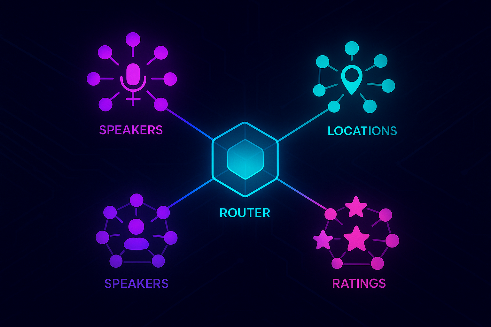

# APIDays Demo



A demo project showcasing a federated GraphQL architecture for API Days Paris 2025.

## Subgraphs

*   **locations**: Manages venue and room information.
*   **speakers**: Manages speaker profiles.
*   **sessions**: Manages conference sessions and schedule.
*   **ratings**: Manages session ratings and aggregation.

## Getting Started

1.  Install dependencies:
    ```bash
    pnpm install
    ```

2.  Start the subgraphs:
    ```bash
    pnpm subgraph:start
    ```

    This will start the subgraphs on the following ports:
    *   Locations: http://localhost:5001
    *   Speakers: http://localhost:5002
    *   Sessions: http://localhost:5003
    *   Ratings: http://localhost:5004

3.  Create a Graph API Token and configure your environment:
    ```bash
    npx wgc router token create apidays -n default -g apidays
    ```
    
    Copy the token and add it to your `.env` file (see `.env.example`):
    ```env
    GRAPH_API_TOKEN=<your-token-here>
    ```

4.  Publish the subgraphs to Cosmo:
    ```bash
    pnpm subgraph:publish:all
    ```

5a. Run the Federation Router (requires Docker and a `.env` file with `GRAPH_API_TOKEN`):
    ```bash
    docker run --name cosmo-router --rm -p 3002:3002 --add-host=host.docker.internal:host-gateway --pull always --env-file .env -e DEV_MODE=true -e DEMO_MODE=true -e LISTEN_ADDR=0.0.0.0:3002 ghcr.io/wundergraph/cosmo/router:latest
    ```

5b. Run the Connect Router (requires `.connect.env`):
    ```bash
    pnpm connect:router
    ```

5c. Run the MCP Router (requires `.mcp.env`):
    ```bash
    pnpm run router:mcp
    ```

## Scripts

*   `pnpm subgraph:start`: Start all subgraphs concurrently (Locations, Speakers, Sessions, Ratings).
*   `pnpm subgraph:check:<subgraph>`: Check a specific subgraph schema against the registry (e.g., `check:locations`).
*   `pnpm subgraph:check:all`: Check all subgraphs against the registry.
*   `pnpm subgraph:publish:<subgraph>`: Publish a specific subgraph schema to the registry (e.g., `publish:locations`).
*   `pnpm subgraph:publish:all`: Publish all subgraphs to the registry.
*   `pnpm supergraph:fetch-schema`: Fetch the latest federated schema from the registry.
*   `pnpm connect:generate-proto`: Generate Protobuf definitions for the AgendaService.
*   `pnpm connect:router`: Run the Connect Router (requires `.connect.env`).
*   `pnpm connect:client-go`: Run the Go client.
*   `pnpm connect:client-ts`: Run the TypeScript client.
*   `pnpm mcp:inspector`: Run the MCP inspector.

**Note:** The `service.proto` and `service.proto.lock.json` files are ignored in this repo to demonstrate the generation process. In a real-world scenario, these should be committed to version control.

